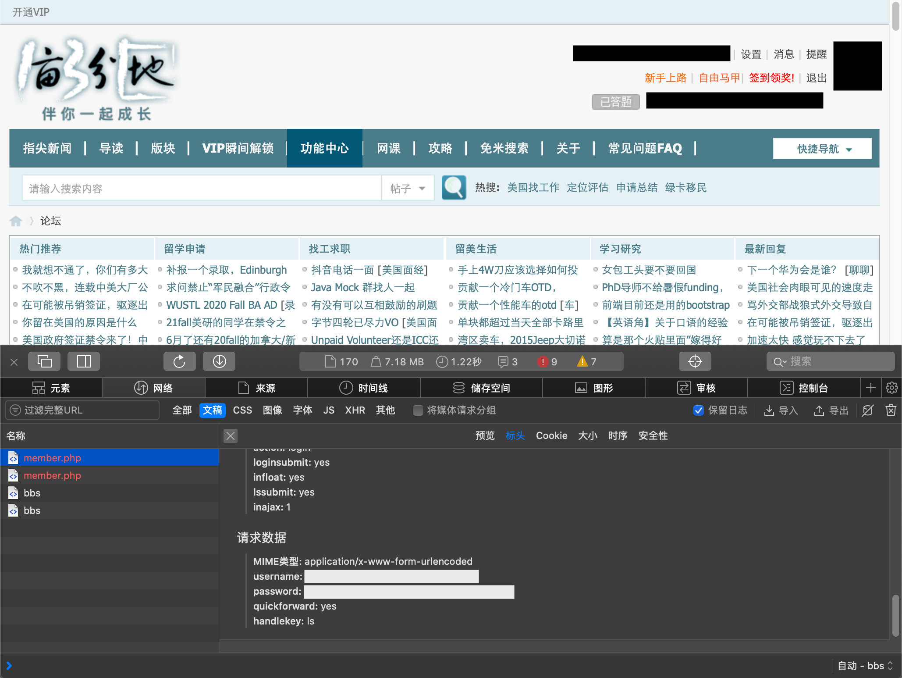

# BotFarmer-1point3acres

BotFarmer 是一亩三分地论坛每日签到、答题赚取积分的自动脚本。项目分为本地命令行交互、AWS 云端部署两个版本。

**本项目仅用于学习交流，如有侵犯论坛利益，请联系我删除仓库！**

## 环境要求

* 开发环境：macOS Catalina 10.15.5
* 测试环境：macOS Catalina 10.15.5
* Python 版本：3.7.6
* python 依赖库：requests, Pillow, pytesseract, boto3
* 软件依赖：tesseract-ocr 4.0.0+, docker


## 使用说明

分别介绍本地命令行版本环境的安装、脚本运行，AWS 云端部署版的搭建，以及tesseract模型的训练。

### 本地命令行交互版

#### 安装 tesseract

一亩三分地论坛在2020年5月底的更新后，每日签到、答题都需要输入验证码，因此我使用 tesseract OCR 识别验证码。接下来介绍 tesseract 的安装和模型导入。

对于 macOS 平台用户，在 `terminal（终端）`应用中输入以下命令，即可安装软件：

```console
$ brew install tesseract
```

接下来查看 tesseract 安装位置，命令及可能的运行结果如下：

```console
$ brew list tesseract

/usr/local/Cellar/tesseract/4.1.1/bin/tesseract
/usr/local/Cellar/tesseract/4.1.1/include/tesseract/ (19 files)
/usr/local/Cellar/tesseract/4.1.1/lib/libtesseract.4.dylib
/usr/local/Cellar/tesseract/4.1.1/lib/pkgconfig/tesseract.pc
/usr/local/Cellar/tesseract/4.1.1/lib/ (2 other files)
/usr/local/Cellar/tesseract/4.1.1/share/tessdata/ (35 files)
```

其中 `/usr/local/Cellar/tesseract/4.1.1/share/tessdata/` 目录中保存了 tesseract 的 OCR 模型，我们将自己训练的模型也放在这个目录下。 在本项目目录 `train-tesseract/` 中的 `verify-codes.traineddata` 文件即为针对一亩三分地验证码所训练的模型。

*进入项目目录 `train-tesseract/`*，运行以下命令导入模型（请根据刚才的输出更改后边目录地址）：

```console
$ cp verify-codes.traineddata /usr/local/Cellar/tesseract/4.1.1/share/tessdata/
```

对于 Windows 平台用户，请访问 [https://digi.bib.uni-mannheim.de/tesseract/](https://digi.bib.uni-mannheim.de/tesseract/ "Tesseract Versions") 下载 tesseract 4.0.0 之后版本的安装包，运行安装包，根据提示将软件安装在本地。

在安装目录（默认为 `C:\Program Files (x86)\Tesseract-OCR`）中找到 `tessdata` 文件夹，将本项目目录 `train-tesseract/` 中的 `verify-codes.traineddata` 文件复制到该文件夹中，完成模型的导入。

#### 安装 Python 依赖库

本项目提供了 `pipenv` 的环境配置文件，打开命令行工具，*进入项目目录 `bot-farmer-local/`*，运行以下命令安装 Python 虚拟环境：

```console
$ pipenv install
```

如果不想创建 Python 虚拟环境，也可以运行以下命令直接安装 Python 依赖库：

```console
$ pip3 install requests Pillow pytesseract
```

#### 修改配置文件

首先我们通过抓包获取一亩三分地前端加密后的登陆密码。用浏览器访问一亩三分地论坛主页 [https://www.1point3acres.com/bbs/](https://www.1point3acres.com/bbs/ "一亩三分地")，退出登录后打开浏览器的网页检查器，选择 `Network（网络）`选项卡，勾选 `Preserve log（保留日志）`选项，保持`录制`为打开状态，如图：


输入用户名和密码，点击登录，这时会录制到对网页的请求，在网页检查器中选择查看 `Doc （文稿）`，找到名称为 `member.php` 的 POST 方法记录，查看它的 `Header （标头）`，滚动到最下边就可以在请求数据中找到网页前端加密后的密码，如图：



在项目目录 `bot-farmer-local/` 中找到 `user.json` 文件，修改文件内容：

```json
{
    "uid": "填写请求数据中username后的值",
    "passwd": "填写请求数据中password后的值"
}
```

#### 运行脚本

打开命令行工具，*进入项目目录 `bot-farmer-local/`*。如果之前安装了 Python 虚拟环境，执行以下命令将其打开：

```console
$ pipenv shell
```

执行以下命令运行脚本进行论坛每日签到、答题：

```console
$ python automatic.py
```

也可以用传递参数的形式单独进行签到、答题操作。

用如下命令进行签到操作：

```console
$ python automatic.py check_in
```

脚本会随机选择一个心情，“今天最想说”中填写某字典每日一句，并自动识别验证码并检查验证码正确性。

用如下命令进行答题操作：

```console
$ python automatic.py take_quiz
```

脚本会获取用户今天的题目和对应的4个选项，并在项目目录 `bot-farmer-local/` 里的 `cheat_sheet.json` 中寻找该题目和正确答案。如果该文件能够提供唯一的答案，脚本会自动作出选择；如果找不到该题目，或者出现未知错误不能提供唯一答案，则会以命令行交互的方式向用户询问答案。之后脚本会自动识别验证码并检查验证码的正确性。在自动提交题目后，脚本会根据一亩三分地论坛的反馈信息判断作答的正确性，并据此更新 `cheat_sheet.json` 文件，将错误的答案删除，保留或添加正确的答案。

如果使用 Python 虚拟环境运行的脚本，关闭命令行工具窗口或执行以下命令退出虚拟环境：

```console
$ exit
```
